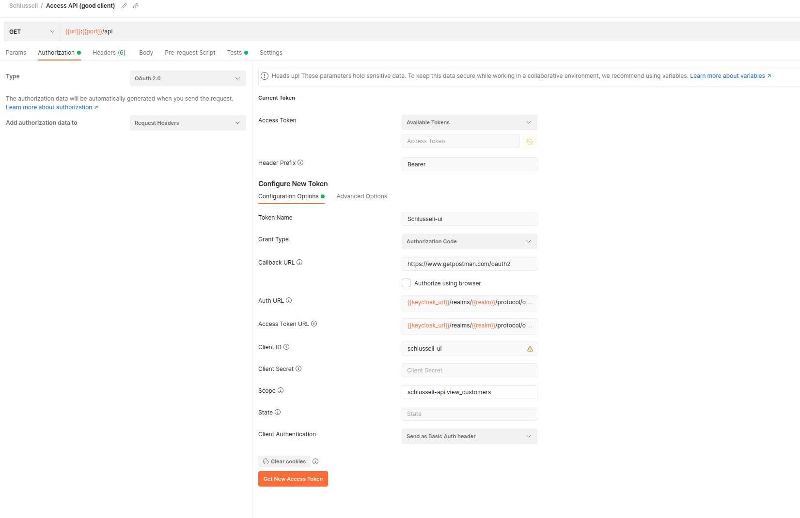

# Schlusseli

A very simple OAuth example using Keycloak.

To start your Phoenix server:

  * Install dependencies with `mix deps.get`
  * Create and migrate your database with `mix ecto.setup`
  * Install Node.js dependencies with `cd assets && npm install`
  * Start Phoenix endpoint with `mix phx.server`

Start schlusseli and keycloak: `./startup.sh`.

Keycloak: Now you can visit [`http://127.0.0.1:8085/auth/`](http://127.0.0.1:8085/auth/) from your browser.

## Keycloak setup

Create 3 clients:

  * `schlusseli-api`: Bearer-only client. The API backend service.
  * `schlusseli-ui`: Confidential client has access to the `schlusseli-api` service.
  * `evil-ui`: Confidential client, has no access to the `schlusseli-api`.

Setup an audience:

  * [Keycloak Audience](https://www.keycloak.org/docs/latest/server_admin/#_audience)
  * The audience of the client token `schlusseli-ui` must include `schlusseli-api`.
  * The app gives only access to clients with the correct audience.

### Bearer-only
The API (`schlusseli`) has no knowledge about the user authentication process. The application only allows bearer token requests.

`Schlusseli` verifies the given JWT Token and gives access to the client.

## Elixir configurations

### Schlusseli.Plug
I added two different plugs to `schlusseli` to play around with the different token verification processes:

  * `Schlusseli.Plug.KeycloakIntorspect`: Uses Keycloak OpenID introspect endpoint to verify the token.
  * `Schlusseli.Plug.OpenidConnector`: Uses the [OpenIDConnect](https://hexdocs.pm/openid_connect/readme.html) hex lib to verify the token against the public key.


### SchlusseliWeb.Schema.Middleware.Authorize
A very simple Middleware to check if the client (`schlusseli-ui`) has the correct scope to access the schema.

Only clients with a `view_customers` scope have access to view all customers.
```Elixir
field :customers, list_of(:customer) do
      middleware(SchlusseliWeb.Schema.Middleware.Authorize, "view_customers")
      resolve(&Resolvers.Customer.list_customers/3)
    end
```

## Postman

Use postman for authorizing requests: https://learning.postman.com/docs/sending-requests/authorization/



## Learn more

**Phoenix**
  * Official website: http://www.phoenixframework.org/
  * Guides: https://hexdocs.pm/phoenix/overview.html
  * Docs: https://hexdocs.pm/phoenix
  * Mailing list: http://groups.google.com/group/phoenix-talk
  * Source: https://github.com/phoenixframework/phoenix

**Keycloak**
  * Server Admin: https://www.keycloak.org/docs/latest/server_admin/
  * Guide: https://www.keycloak.org/docs/latest/getting_started/ 

**Useful links**
  * JSON Web Key Set Properties: https://auth0.com/docs/security/tokens/json-web-tokens/json-web-key-set-properties
  * JWT Debugger: https://jwt.io/
  * Secure your Microservices with Keycloak: [2019-NN-Sebastien_Blanc-Easily_Secure_your_Microservices_with_Keycloak-Praesentation.pdf](https://www.doag.org/formes/pubfiles/11143470/2019-NN-Sebastien_Blanc-Easily_Secure_your_Microservices_with_Keycloak-Praesentation.pdf)
#
